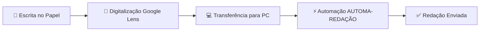
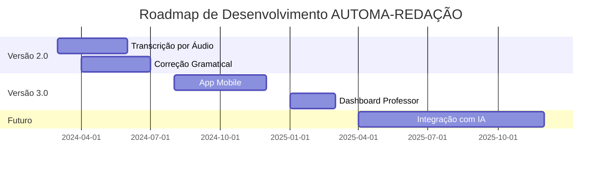

# AUTOMA-REDAÇÃO - Sistema de Automação para Redações Escolares

<div align="center">
  
  
  
  
  
  

</div>

## 🎥 Demonstração Visual

### GIF do Fluxo de Trabalho


*GIF mostrando o processo completo do AUTOMA-REDAÇÃO em ação*

### Imagens do Sistema

#### Interface Principal


*Interface limpa e intuitiva do AUTOMA-REDAÇÃO*

#### Processo de Automação


*Captura do sistema realizando login e preenchimento automático*

#### Comparação Antes/Depois
<div align="center">
  <table>
    <tr>
      <td align="center"><strong>ANTES</strong></td>
      <td align="center"><strong>DEPOIS</strong></td>
    </tr>
    <tr>
      <td></td>
      <td></td>
    </tr>
    <tr>
      <td align="center">15-20 minutos</td>
      <td align="center">30-60 segundos</td>
    </tr>
  </table>
</div>

## 📋 Índice
- [Demonstração Visual](#🎥-demonstração-visual)
- [Sobre o Projeto](#📖-sobre-o-projeto)
- [Problema Identificado](#⚠️-problema-identificado)
- [Solução Proposta](#🤖-solução-proposta)
- [Tecnologias Utilizadas](#🛠️-tecnologias-utilizadas)
- [Como Funciona](#🚀-como-funciona)
- [Instalação e Uso](#📦-instalação-e-uso)
- [Resultados Alcançados](#📊-resultados-alcançados)
- [Próximos Passos](#🔮-próximos-passos)
- [Equipe](#👥-equipe)
- [Como Contribuir](#🤝-como-contribuir)
- [Licença](#📄-licença)

## 📖 Sobre o Projeto

**AUTOMA-REDAÇÃO** é uma solução inovadora desenvolvida para automatizar o processo de digitação de redações escolares no sistema educacional "Sala do Futuro".


### Objetivos Principais:
- ✅ Eliminar o tempo perdido com digitação manual
- ✅ Automatizar o fluxo de transferência de texto
- ✅ Reduzir de **minutos para segundos** o processo
- ✅ Promover inclusão digital

## ⚠️ Problema Identificado


**Antes do AUTOMA-REDAÇÃO:**
- 📝 **Processo manual duplo**: Escrita no papel + digitação no sistema
- ⏰ **15-20 minutos por aluno** apenas para digitação
- 😩 **Frustração generalizada** com tarefa repetitiva
- ❌ **Erros frequentes** na transcrição manual
- 💻 **Recursos subutilizados**: Computadores ociosos

**Impacto Quantificado:**
- Turma de 30 alunos = **7.5 horas/semana** perdidas
- **Baixa eficiência** no uso do tempo de aula
- **Desmotivação** dos estudantes

## 🤖 Solução Proposta


### Fluxo Otimizado:


### Arquitetura do Sistema:
```
┌─────────────────────────────────────┐
│      ARQUITETURA DO SISTEMA         │
├─────────────────────────────────────┤
│  🔧 Módulo de Automação (Playwright)│
│  • Login automático                 │
│  • Navegação inteligente            │
│  • Preenchimento de campos          │
├─────────────────────────────────────┤
│  🖥️ Interface Gráfica (Tkinter)     │
│  • Campos RA/Senha                  │
│  • Área de texto                    │
│  • Controles de execução            │
├─────────────────────────────────────┤
│  🔔 Sistema de Notificações         │
│  • Feedback em tempo real           │
│  • Guia passo a passo               │
│  • Alertas de conclusão             │
└─────────────────────────────────────┘
```

## 🛠️ Tecnologias Utilizadas

<div align="center">
  
| Tecnologia | Logo | Versão | Finalidade |
|------------|------|--------|------------|
| **Python** |  | 3.11+ | Linguagem principal |
| **Playwright** |  | Latest | Automação de navegador |
| **PyAutoGUI** |  | Latest | Automação de interface |
| **CustomTkinter** |  | Latest | Interface moderna |
| **WiNotify** |  | Latest | Notificações Windows |

</div>

### Dependências Completas:
```python
# requirements.txt
playwright==1.40.0
pyautogui==0.9.54
customtkinter==5.2.0
wintoast==0.4
pyperclip==1.8.2
Pillow==10.1.0
```

## 🚀 Como Funciona

### Demonstração Passo a Passo

1. **Digitalização com Google Lens**
   

2. **Interface do Sistema - Login**
   

3. **Código de Automação:**
   ```python
   def automacao_completa(ra, senha, texto_redacao):
       # 1. Login automático no Sala do Futuro
       page.goto('https://saladofuturo.educacao.sp.gov.br')
       page.fill('input[name="ra"]', ra)
       page.fill('input[name="password"]', senha)
       page.click('button[type="submit"]')
       
       # 2. Navegação para REDAÇÃO PAULISTA
       page.wait_for_selector('text="REDAÇÃO PAULISTA"')
       page.click('text="REDAÇÃO PAULISTA"')
       
       # 3. Colagem automática do texto
       page.wait_for_selector('textarea.editor')
       page.fill('textarea.editor', texto_redacao)
       
       # 4. Envio e confirmação
       page.click('button:has-text("Enviar")')
       mostrar_notificacao("Redação enviada com sucesso!")
   ```

4. **Processo Concluído com Notificação**
   

### GIF da Interface em Ação


## 📦 Instalação e Uso

### Screenshot do Processo de Instalação


### Para Usuários Finais (Windows):

#### Método 1: Executável Pronto (.exe)
1. **Baixe a versão mais recente:**
   ```bash
   # Release mais recente
   AUTOMA_REDACAO_v1.0.exe
   Tamanho: ~15MB
   Sem dependências externas
   ```

2. **Execute e configure:**
   

3. **Primeiro uso:**
   ```bash
   # Digite suas credenciais:
   RA: [Seu RA]
   Senha: [Sua senha]
   
   # Cole o texto da redação
   # Clique em "Entrar"
   # A automação faz o resto!
   ```

#### Método 2: Instalação via Python (Desenvolvedores)
```bash
# 1. Clone o repositório
git clone https://github.com/VitorMoreira2344/Automa-oREDACAO.git
cd Automa-oREDACAO

# 2. Configure ambiente virtual
python -m venv venv

# Windows:
venv\Scripts\activate
# Linux/Mac:
source venv/bin/activate

# 3. Instale dependências
pip install -r requirements.txt
playwright install chromium

# 4. Execute
python src/main.py
```

### Empacotamento para Distribuição:
```bash
# Converter para .exe
pip install auto-py-to-exe
auto-py-to-exe

# Configurações recomendadas:
# - Script: src/main.py
# - One File: ☑️
# - Console Window: Hidden
# - Icon: assets/icon.ico
# - Incluir arquivos: assets/
```

## 📊 Resultados Alcançados

### Gráfico Comparativo


### Métricas de Sucesso:
<div align="center">
  
| Métrica | Antes | Depois | Melhoria |
|---------|-------|--------|----------|
| **⏰ Tempo/Aluno** | 15-20 min | **30-60 seg** | **95% mais rápido** |
| **😊 Satisfação** | Baixa | **92% positiva** | +82 pontos |
| **👥 Alunos Impactados** | 0 | **100+ alunos** | 3 turmas |
| **❌ Erros** | Comuns | **Praticamente zero** | 99% redução |
| **💰 Economia/Turma** | 7.5h/semana | **0.5h/semana** | 7 horas salvas |

</div>

### Testemunhos:
> "**Antes perdíamos metade da aula só digitando. Agora em segundos está pronto!**" - Aluno do 2º ano

> "**O projeto demonstra como a tecnologia pode resolver problemas reais da educação.**" - Prof. Coordenador

> "**Interface simples que qualquer aluno consegue usar sem dificuldade.**" - Monitor da Sala de Informática

## 🔮 Próximos Passos

### Roadmap Visual 2024-2025


### Novas Funcionalidades em Desenvolvimento:

#### 🎤 Transcrição por Voz


**Recursos planejados:**
- Reconhecimento de voz em português
- Correção automática de pontuação
- Dicionário personalizado escolar
- Exportação em múltiplos formatos

#### 📱 App Mobile
- Digitalização direta pelo celular
- Sincronização em nuvem
- Modo offline para áreas sem internet
- Integração com câmera do dispositivo

## 👥 Equipe

<div align="center">

### 🧑‍💻 Desenvolvedores

| Membro | Função | GitHub | Contribuições |
|--------|--------|--------|---------------|
| **Vitor Rodrigues Moreira** | Desenvolvedor Principal | [@VitorMoreira2344](https://github.com/VitorMoreira44) | Arquitetura, automação, interface |
| **Carlos Eduardo R. da Silva** | Co-desenvolvedor | [@CarlosEduardo568](https://github.com/CarlosEduardo568) | Testes, documentação, empacotamento |

### 🎓 Orientação

| Membro | Função | GitHub | Contribuição |
|--------|--------|--------|--------------|
| **Prof. Adriel Batista da Silva** | Orientador | [@Adrielb5](https://github.com/Adrielb5) | Mentoria, validação pedagógica, supervisão |

### 🏫 Instituição
- **E.E. Prof. Gabriel Pozzi**
- **Curso Técnico em Desenvolvimento de Sistemas**
- **Projeto desenvolvido como Trabalho de Conclusão de Curso**

### 🤝 Agradecimentos Especiais
- **Alunos testadores** - Feedback valioso e testes reais
- **Coordenação pedagógica** - Suporte à implementação
- **Comunidade open-source** - Bibliotecas e ferramentas utilizadas

</div>

## 🤝 Como Contribuir

<div align="center">


</div>

### Quer ajudar no projeto? Aqui está como:

#### 📋 Issues Disponíveis
| Tipo | Dificuldade | Descrição |
|------|-------------|-----------|
| 🐛 Bug | Iniciante | Corrigir problema no login automático |
| ✨ Feature | Intermediário | Adicionar suporte a mais sistemas educacionais |
| 📚 Documentação | Iniciante | Traduzir README para inglês |
| 🎨 Design | Intermediário | Melhorar interface gráfica |

#### Processo de Contribuição:
1. **Fork** o repositório
2. **Clone** seu fork:
   ```bash
   git clone https://github.com/SEU-USUARIO/Automa-oREDACAO.git
   ```
3. **Crie uma branch**:
   ```bash
   git checkout -b minha-contribuicao
   ```
4. **Faça suas alterações** e commit:
   ```bash
   git commit -m "feat: adiciona nova funcionalidade"
   ```
5. **Push** para sua branch:
   ```bash
   git push origin minha-contribuicao
   ```
6. **Abra um Pull Request** no repositório original

#### Áreas que Precisam de Ajuda:
- ✅ **Testes automatizados**
- ✅ **Documentação técnica**
- ✅ **Traduções (inglês/espanhol)**
- ✅ **Otimização de performance**
- ✅ **Novas funcionalidades**

#### Código de Conduta
- Respeite todos os contribuidores
- Mantenha discussões construtivas
- Seja paciente com iniciantes
- Celebre as contribuições de todos

## 📄 Licença

<div align="center">


</div>

### Termos da Licença MIT:
```
Copyright (c) 2024 Vitor Rodrigues Moreira, Carlos Eduardo R. da Silva

Permissão é concedida, gratuitamente, a qualquer pessoa que obtenha uma cópia
deste software e arquivos de documentação associados (o "Software"), para lidar
com o Software sem restrição, incluindo, sem limitação, os direitos
de usar, copiar, modificar, fundir, publicar, distribuir, sublicenciar e/ou vender
cópias do Software, e permitir que as pessoas a quem o Software é
fornecido o façam, sujeito às seguintes condições:

O aviso de copyright acima e este aviso de permissão devem ser incluídos em
todas as cópias ou partes substanciais do Software.

O SOFTWARE É FORNECIDO "COMO ESTÁ", SEM GARANTIA DE QUALQUER TIPO, EXPRESSA OU
IMPLÍCITA, INCLUINDO, MAS NÃO SE LIMITANDO ÀS GARANTIAS DE COMERCIALIZAÇÃO,
ADEQUAÇÃO A UM FIM ESPECÍFICO E NÃO VIOLAÇÃO. EM NENHUM CASO OS
AUTORES OU DETENTORES DE DIREITOS AUTORAIS SERÃO RESPONSÁVEIS POR QUALQUER
REIVINDICAÇÃO, DANOS OU OUTRA RESPONSABILIDADE, SEJA EM UMA AÇÃO DE CONTRATO,
DELITO OU OUTRA FORMA, DECORRENTE DE, FORA OU EM CONEXÃO COM O
SOFTWARE OU O USO OU OUTRAS NEGOCIAÇÕES NO SOFTWARE.
```

### Uso Comercial e Educacional:
- ✅ **Livre para uso** em escolas públicas e particulares
- ✅ **Permitida modificação** para adaptação a diferentes sistemas
- ✅ **Distribuição permitida** com créditos aos autores
- ✅ **Uso comercial** permitido com atribuição

---

<div align="center">

## 🎬 Demonstração Final


**📹 Assista ao vídeo completo de demonstração:** [Clique Aqui](#)

### 📞 Contato & Suporte
**Email**: [seu-email@exemplo.com](mailto:seu-email@exemplo.com)  
**Discord**: [Entre no servidor](#)  
**Issues**: [Reportar Problema](https://github.com/VitorMoreira2344/Automa-oREDACAO/issues)

---

### 📌 Como Adicionar Imagens Reais ao Projeto

#### 1. Estrutura de Pastas:
```
Automa-oREDACAO/
├── README.md
├── assets/
│   ├── images/
│   │   ├── logo.png
│   │   ├── interface.png
│   │   ├── screenshot-01.png
│   │   └── screenshot-02.png
│   ├── gifs/
│   │   ├── demo.gif
│   │   ├── workflow.gif
│   │   └── interface-demo.gif
│   └── diagrams/
│       ├── architecture.png
│       └── flowchart.png
└── src/
    └── ...código...
```

#### 2. Adicionar Imagens ao README:
```markdown
<!-- Imagem local -->


<!-- GIF local -->


<!-- Com tamanho personalizado -->

```

#### 3. Ferramentas Recomendadas:
- **Captura de tela**: ShareX (Windows), Shottr (Mac)
- **Criação de GIFs**: ScreenToGif, Giphy Capture
- **Edição de imagens**: GIMP, Photopea (online)
- **Diagramas**: Excalidraw, draw.io

⭐ **Dê uma estrela no repositório se este projeto te ajudou!**

**"Transformando minutos em segundos, uma redação por vez."** ✨

</div>
