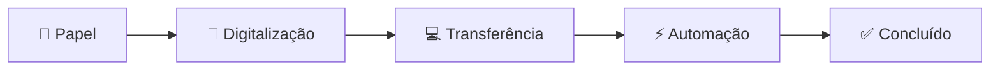
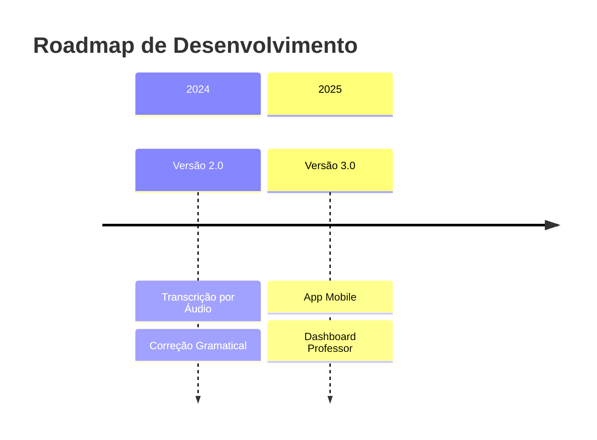

# AUTOMA-REDAÇÃO - Sistema de Automação para Redações Escolares

<div align="center">
  
  
  
  
  

</div>

## 🎥 Demonstração Visual

### GIF do Fluxo de Trabalho


*GIF mostrando o processo completo do AUTOMA-REDAÇÃO em ação*

### Imagens do Sistema

#### Interface Principal


*Interface limpa e intuitiva do AUTOMA-REDAÇÃO*

#### Processo de Automação


*Captura do sistema realizando login e preenchimento automático*

#### Comparação Antes/Depois
<div align="center">
  <table>
    <tr>
      <td align="center"><strong>ANTES</strong></td>
      <td align="center"><strong>DEPOIS</strong></td>
    </tr>
    <tr>
      <td></td>
      <td></td>
    </tr>
    <tr>
      <td align="center">15-20 minutos</td>
      <td align="center">30-60 segundos</td>
    </tr>
  </table>
</div>

## 📋 Índice
- [Demonstração Visual](#🎥-demonstração-visual)
- [Sobre o Projeto](#📖-sobre-o-projeto)
- [Problema Identificado](#⚠️-problema-identificado)
- [Solução Proposta](#🤖-solução-proposta)
- [Tecnologias Utilizadas](#🛠️-tecnologias-utilizadas)
- [Como Funciona](#🚀-como-funciona)
- [Instalação e Uso](#📦-instalação-e-uso)
- [Resultados Alcançados](#📊-resultados-alcançados)
- [Próximos Passos](#🔮-próximos-passos)
- [Equipe](#👥-equipe)
- [Licença](#📄-licença)

## 📖 Sobre o Projeto

**AUTOMA-REDAÇÃO** é uma solução inovadora desenvolvida para automatizar o processo de digitação de redações escolares no sistema educacional "Sala do Futuro".


### Objetivos Principais:
- ✅ Eliminar o tempo perdido com digitação manual
- ✅ Automatizar o fluxo de transferência de texto
- ✅ Reduzir de **minutos para segundos** o processo
- ✅ Promover inclusão digital

## ⚠️ Problema Identificado


**Antes do AUTOMA-REDAÇÃO:**
- 📝 **Processo manual duplo**
- ⏰ **15-20 minutos por aluno**
- 😩 **Frustração generalizada**
- ❌ **Erros frequentes**

## 🤖 Solução Proposta


### Fluxo Otimizado:


## 🛠️ Tecnologias Utilizadas

<div align="center">
  
| Tecnologia | Logo | Descrição |
|------------|------|-----------|
| **Python** |  | Linguagem principal |
| **Playwright** |  | Automação de navegador |
| **Tkinter** |  | Interface gráfica |

</div>

## 🚀 Como Funciona

### Demonstração Passo a Passo

1. **Digitalização com Google Lens**
   

2. **Interface do Sistema**
   

3. **Automação em Tempo Real**
   ```python
   # Código de exemplo
   def automacao_login(ra, senha, texto):
       # Login automático
       # Navegação para redação
       # Preenchimento automático
   ```

4. **Processo Concluído**
   

### GIF da Interface em Ação


## 📦 Instalação e Uso

### Screenshot do Processo de Instalação


### Passos Visuais:

**1. Baixe o executável:**
```
📁 AUTOMA_REDACAO.exe
└── 📊 Tamanho: ~15MB
```

**2. Execute o aplicativo:**


**3. Configure suas credenciais:**


## 📊 Resultados Alcançados

### Gráfico Comparativo


### Métricas Visuais:
<div align="center">
  
| | Antes | Depois |
|-|-------|--------|
| **⏰ Tempo** |  |  |
| **😊 Satisfação** |  |  |
| **👥 Alunos** |  |  |

</div>

## 🔮 Próximos Passos

### Roadmap Visual


### Prévia das Novas Funcionalidades


## 👥 Equipe

<div align="center">

| Membro | Função | Foto |
|--------|--------|------|
| **Vitor Rodrigues** | Dev Principal |  |
| **Carlos Eduardo** | Co-dev |  |
| **Prof. Adriel** | Orientador |  |

</div>

## 📄 Licença

<div align="center">


</div>

---

<div align="center">

## 🎬 Demonstração Final


**Assista ao vídeo completo de demonstração:** [Clique Aqui](#)

---

### 📌 Como Adicionar Suas Próprias Imagens

Para substituir os placeholders por suas próprias imagens:

1. **Crie uma pasta `assets/` no seu repositório**
2. **Adicione suas imagens:**
   - `assets/demo.gif` - GIF demonstrativo
   - `assets/interface.png` - Screenshot da interface
   - `assets/logo.png` - Logo do projeto
   - `assets/diagrama.png` - Diagrama do fluxo

3. **Atualize os links no README:**
```markdown


```

### 🎯 Dicas para Criar Conteúdo Visual:

1. **Screenshots:**
   - Use `Win + Shift + S` (Windows) ou `Cmd + Shift + 4` (Mac)
   - Salve em PNG para melhor qualidade

2. **GIFs:**
   - Use [ScreenToGif](https://www.screentogif.com/) (Windows)
   - Ou [Giphy Capture](https://giphy.com/apps/giphycapture) (Mac)
   - Mantenha GIFs curtos (5-10 segundos)

3. **Diagramas:**
   - Use [Excalidraw](https://excalidraw.com/) para diagramas
   - Ou [Mermaid](https://mermaid.js.org/) para diagramas em texto

4. **Formatos Recomendados:**
   - GIFs: Máximo 800x450px, otimizados
   - Imagens: PNG para screenshots, SVG para logos
   - Vídeos: MP4 curto ou link para YouTube

---

⭐ **Dê uma estrela no repositório se este projeto te ajudou!**

**"Transformando minutos em segundos, uma redação por vez."** ✨

</div>

## 🛠️ Guia Prático: Como Adicionar Imagens Reais

### Opção 1: Usando Imagens do Repositório
```markdown
<!-- Imagem local -->


<!-- GIF local -->

```

### Opção 2: Usando URLs Externas
```markdown
<!-- Imagem do Imgur, GitHub, etc -->


```

### Opção 3: Usando GitHub Issues para Upload
1. Crie uma nova issue
2. Arraste e solte suas imagens
3. GitHub criará links automaticamente
4. Copie os links Markdown gerados

### Estrutura de Pastas Recomendada:
```
seu-repositorio/
├── README.md
├── assets/
│   ├── images/
│   │   ├── logo.png
│   │   ├── interface.png
│   │   └── screenshot-01.png
│   ├── gifs/
│   │   ├── demo.gif
│   │   └── workflow.gif
│   └── diagrams/
│       └── flowchart.png
└── src/
    └── ...código...
```

Lembre-se: **GitHub tem limite de 100MB por arquivo** para uploads diretos. Para arquivos maiores, use links externos.
